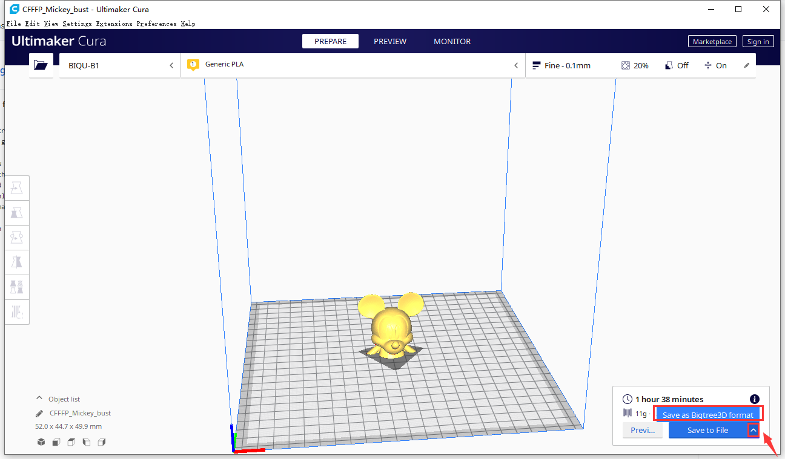

# Bigtree3DPlugin
Bigtree3D G-code for model previews

## How to Install
1. Update touch screen firmware to a version after [this Pull Request](https://github.com/bigtreetech/BIGTREETECH-TouchScreenFirmware/pull/844). The first release to include this feature will be `Vx.x.27`.
2. Enable model previews by disabling `List Mode` under `Menu -> Settings -> Feature -> Files viewer List Mode`.
3. Download [this zip file](https://github.com/bigtreetech/Bigtree3DPluginSuit/archive/master.zip), unzip.
4. Find your Cura plugins directory:
   * Windows: The default installation path is `C:\Program Files\Ultimaker Cura [version number]\plugins`.
   * macOS: Right-click on `Ultimaker Cura.app` in your `Applications` folder then click on `Show Package Contents`. The default installation path is `Ultimaker Cura.app -> Contents -> Resources -> Plugins`.
5. Copy the extracted `Bigtree3DPlugin` folder to the Cura plugins folder you located in Step 4:
   
   

6. Open the STL model in Cura and click `Slice`.
7. Click the small up arrow on the right and select `Save as Bigtree3D format`:
   
   

   
8. Model preview is now available:
    

        
        
    

## Which version of hardware supports this feature?
 * All versions of touch screen hardware released by BIGTREETECH support this feature as long as the firmware is updated, including TFT24/TFT28/TFT35/TFT43/TFT50/TFT70...
